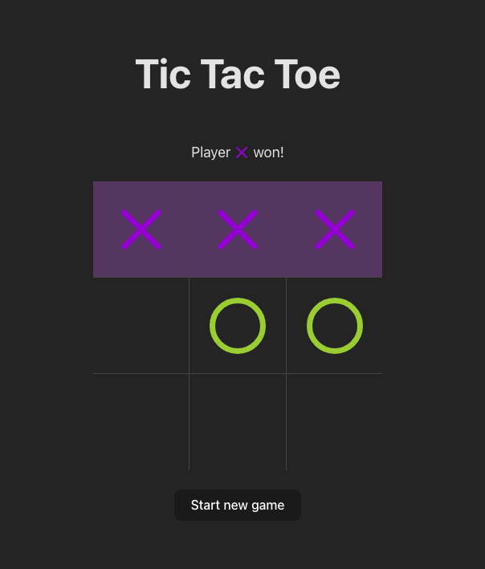

# Tic Tac Toe / Крестики-Нолики

[](https://react.dev/)
[](https://www.typescriptlang.org/)
[](https://vitejs.dev/)

<div align="center">
  
</div>

## In English

### 🎯 Learning Project
**Goals**: Explore React 19 and ecosystem features:
- Functional components practice
- State management with Redux Toolkit
- Render optimization (useCallback, memo)
- TypeScript integration
- Vite build setup

### 🎮 Implementation Highlights
- Win detection with line highlighting
- Move counter with auto-reset
- Localized UI (Russian/English)
- Mobile-friendly responsive design
- Custom UI components (buttons, cells)

### 🛠 Tech Stack
- React 19 (hooks, functional components)
- TypeScript (type-safe store and components)
- Redux Toolkit (global game state)
- Vite (fast build and dev server)
- SCSS Modules (component styling)

## In Russian

### 🎯 Учебный проект
**Цель**: Изучение возможностей React 19 и экосистемы:
- Работа с функциональными компонентами
- Управление состоянием через Redux Toolkit
- Оптимизация рендеров (useCallback, memo)
- Типизация приложения с TypeScript
- Сборка проекта на Vite

### 🎮 Особенности реализации
- Определение победителя с подсветкой линии
- Счётчик ходов с автоматическим сбросом
- Локализованный интерфейс (русский/английский)
- Адаптивная вёрстка для мобильных устройств
- Кастомные UI-компоненты (кнопки, ячейки)

### 🛠 Стек технологий
- **React 19** (хуки, функциональные компоненты)
- **TypeScript** (типизация хранилища и компонентов)
- **Redux Toolkit** (глобальное состояние игры)
- **Vite** (быстрая сборка и dev-сервер)
- **SCSS Modules** (стилизация компонентов)

## ⚙️ Getting Started / Запуск проекта

1. Clone repository / Клонировать репозиторий:
```bash
git clone git@github.com:hellsgor/tic-tac-toe.git
```

2. Install dependencies / Установить зависимости:
```bash
npm install
```

3. Run dev server / Запустить в режиме разработки:
```bash
npm run dev
```
